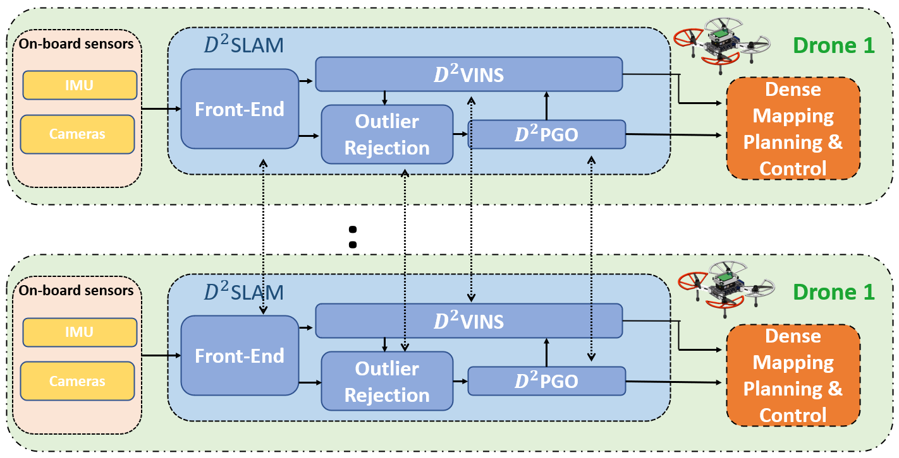
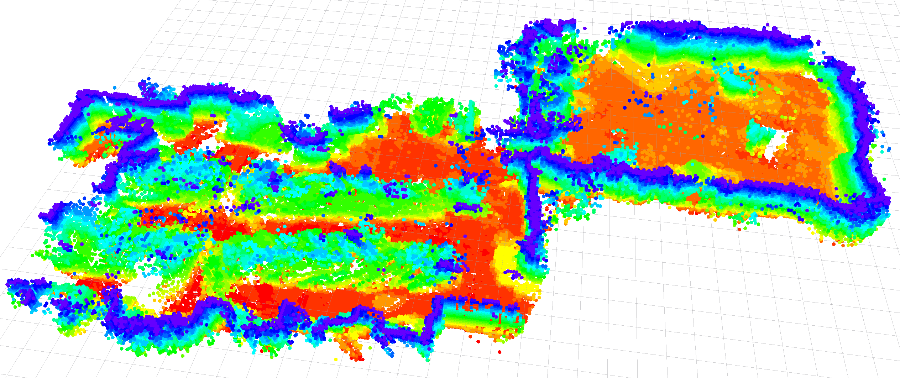

# $D^2$SLAM: Decentralized and Distributed Collaborative Visual-inertial SLAM System for Aerial Swarm

## Introduction
$D^2$SLAM: Decentralized and Distributed Collaborative Visual-inertial SLAM System for Aerial Swarm

 A crucial technology in fully autonomous aerial swarms is collaborative SLAM (CSLAM), which enables the estimation of relative pose and global consistent trajectories of aerial robots. 
However, existing CSLAM systems do not prioritize relative localization accuracy, critical for close collaboration among UAVs.
This paper and open-source project presents $D^2$SLAM, a novel decentralized and distributed ($D^2$) CSLAM system that covers two scenarios: near-field estimation for high accuracy state estimation in close range and far-field estimation for consistent global trajectory estimation. 





We argue $D^2$SLAM can be applied in a wide range of real-world applications.

Our pre-print paper is currently available at https://arxiv.org/abs/2211.01538

Citation:
```
@article{xu2022d,
  title={{$ D\^{} 2$ SLAM: Decentralized and Distributed Collaborative Visual-inertial SLAM System for Aerial Swarm}},
  author={Xu, Hao and Liu, Peize and Chen, Xinyi and Shen, Shaojie},
  journal={arXiv preprint arXiv:2211.01538},
  year={2022}
}
```

## Usage
D2SLAM uses CUDA for front-end acceleration, so CUDA support is currently necessary to run D2SLAM.
D2SLAM has numerous dependencies, and we recommend compiling D2SLAM using our docker. We provide two dockers, one for PC and one for the embedded platform, Nvidia Jetson. We have evaluated D2SLAM on Nvidia Xavier NX.
For details on docker compilation, please refer to the [documentation.](./docker/README.md)

## Datasets

Will be release very soon

## License
LGPL-3